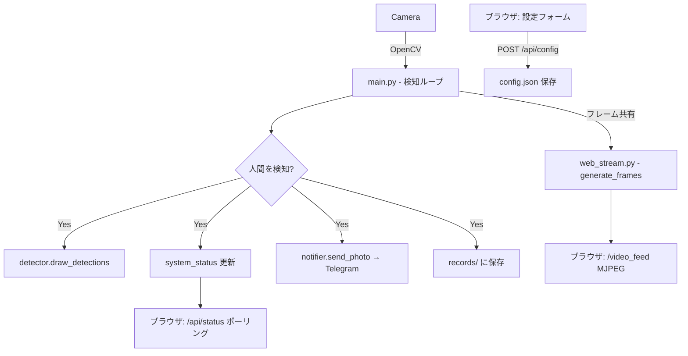

# 詳細設計：Raspberry Pi 4 人間検知監視カメラアプリ

## 1. システムアーキテクチャ
システムはマルチスレッド型アプリケーションとして構成する。

| スレッド/モジュール | 役割 |
|---|---|
| カメラキャプチャ・スレッド | OpenCVで映像取得、スレッドセーフなバッファに書き込み |
| 検知エンジン（メインループ） | バッファからフレームを取得しTFLiteで人間検知 |
| Web配信・スレッド | FlaskでMJPEGストリーミングおよびWeb管理画面を提供 |
| 通知/保存モジュール | 検知イベント発生時にTelegram APIへ送信・画像保存 |

## 2. テクノロジースタック

| カテゴリ | 採用技術 | 理由 |
|---|---|---|
| 言語 | Python 3.9+ | |
| 画像処理 | OpenCV (cv2) | |
| AIエンジン | TensorFlow Lite (`tflite-runtime`) | Raspberry Pi 4 での高速動作 |
| AIモデル | SSD MobileNet V2 (COCOデータセット) | 人間検知に特化、軽量 |
| Webフレームワーク | Flask | 軽量なストリーミング・UI配信 |
| 通知 | Telegram Bot API (`requests`) | |
| 依存バージョン | `numpy<2` | NumPy 2.0 との互換性エラー回避 |

## 3. プロジェクト構成

```
project/
├── main.py           # エントリーポイント。スレッド制御・検知ループ
├── camera.py         # スレッドセーフなカメラキャプチャクラス
├── detector.py       # TFLiteを使用した人間検知エンジン
├── notifier.py       # Telegram通知モジュール
├── web_stream.py     # Flask Web管理画面・ストリーミング・API
├── config.json       # 全設定を管理する外部設定ファイル
├── requirements.txt  # 依存ライブラリ
├── setup_model.py    # TFLiteモデルの自動ダウンロードスクリプト
└── records/          # 検知時の画像・動画の保存先
```

## 4. 主要機能の設計

### 4.1 カメラキャプチャ (`camera.py`)
- `Camera` クラスが専用スレッドで常時フレームを取得。
- `threading.Lock` によりスレッドセーフなバッファリングを実現。

### 4.2 人間検知 (`detector.py`)
- `HumanDetector` クラスが TFLite Interpreter を保持。
- `detect(frame)` が前処理・推論・後処理を行い、バウンディングボックスリストを返す。
- `draw_detections(frame, detections)` で検知枠を描画。

### 4.3 Web管理画面 (`web_stream.py`)

| URL | メソッド | 説明 |
|---|---|---|
| `/` | GET | ダークテーマの管理ダッシュボードを返す |
| `/video_feed` | GET | MJPEG ストリーミングを返す |
| `/api/status` | GET | JSON形式で動作ステータスを返す |
| `/api/config` | POST | JSON形式で設定を受け取り `config.json` を更新 |

**`/api/status` レスポンス例:**
```json
{
  "running": true,
  "detections_total": 5,
  "last_detected": "2026-02-25 14:53:00",
  "fps": 15.2,
  "human_count": 1,
  "stream_width": 640,
  "stream_height": 480
}
```

### 4.4 ヘッドレス対応
- `config.json` の `use_gui: false` でモニター出力を無効化。
- `cv2.imshow` / `cv2.waitKey` は try-except で保護し、エラー時は自動無効化。

### 4.5 Telegram通知 (`notifier.py`)
- 検知の確信度が閾値を超えた場合、`notify_interval` 秒に1回スナップショットを送信。
- 画像を一時ファイルとして保存して送信後に削除。

## 5. 設定スキーマ (`config.json`)

| キー | 型 | 説明 |
|---|---|---|
| `telegram_token` | string | Telegram Bot のトークン |
| `telegram_chat_id` | string | 通知先のチャットID |
| `detection_threshold` | float | 検知閾値 (0.1〜1.0) |
| `notify_interval` | int | Telegram通知の最低間隔（秒） |
| `model_path` | string | TFLiteモデルファイルのパス |
| `video_source` | int | カメラデバイス番号 |
| `save_directory` | string | 画像保存ディレクトリ |
| `stream_width` | int | Webストリーミング幅（px） |
| `stream_height` | int | Webストリーミング高さ（px） |
| `use_gui` | bool | モニター出力の有効／無効 |

## 6. データフロー


