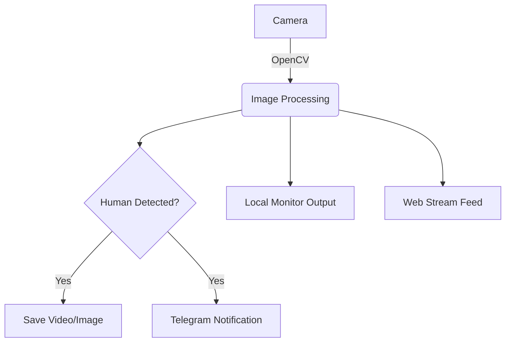

# 詳細設計：Raspberry Pi 4 人間検知監視カメラアプリ

## 1. システムアーキテクチャ
システムは以下のコンポーネントで構成されるマルチスレッド型アプリケーションとする。

- **カメラキャプチャ・スレッド**: OpenCVを使用して映像を取得し、共有バッファに書き込む。
- **検知エンジン・スレッド**: バッファからフレームを取得し、AIモデルで人間を検知する。
- **Web配信・スレッド**: Flask/FastAPIを使用して、MJPEGストリーミングを配信する。
- **通知/保存モジュール**: 検知イベント発生時にTelegram APIを叩き、画像を保存する。

## 2. テクノロジースタック
- **言語**: Python 3.9+
- **画像処理**: OpenCV (cv2)
- **AIエンジン**: TensorFlow Lite (Raspberry Pi 4での高速動作のため)
- **AIモデル**: MobileNet SSD v2 (human detectionに特化)
- **Webフレームワーク**: Flask (軽量なストリーミング配信のため)
- **通知**: Telegram Bot API (`python-telegram-bot`)

## 3. 主要機能の設計

### 3.1 モニター出力 (GUI)
- OpenCVの `cv2.imshow()` をメインスレッドまたは専用スレッドで使用し、HDMI接続されたモニターにリアルタイム映像を表示。

### 3.2 Webストリーミング
- `/video_feed` エンドポイントを提供。
- `multipart/x-mixed-replace` 形式でストリーミング。

### 3.3 Telegram通知
- 人間検知の確信度（Confidence）が閾値（例: 0.6）を超えた場合、検知時のスナップショットを Telegram Bot 経由で送信。

### 3.4 録画機能
- `cv2.VideoWriter` を使用。検知中および検知前後の数秒間を保存するバッファリングロジックを検討。

## 4. データフロー (Mermaid)

